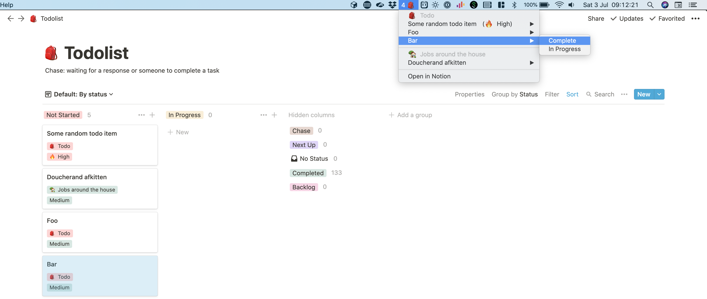

# Notion swiftbar

Swiftbar plugin to display my Notion todo items.



Swiftbar: https://github.com/swiftbar

## Install example plugin

```
mv src/exampe.60s.sh build
ln -s -v /Users/jvandenberghe/Projects/notion-swiftbar/build/ ~/swiftbarPlugins/notionSwiftbar
chmod +x /Users/jvandenberghe/Projects/notion-swiftbar/build/exampe.60s.sh
```

## JSDoc

Trying some extensive JSDoc in this project.
